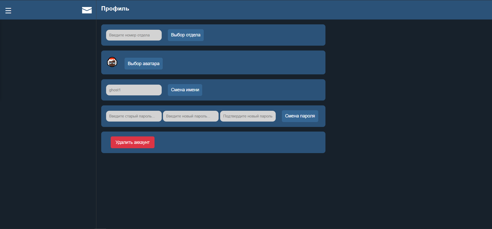
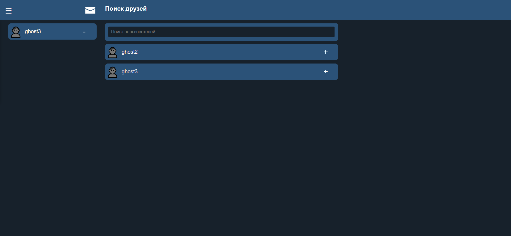

# CosmoChat

## Описание

Это веб-приложение мессенджера, созданное с использованием **FastAPI**. Приложение поддерживает:
- Аутентификацию пользователей (регистрация, вход, выход);
- Хранение данных в базе SQLite;
- Общение пользователей в реальном времени через WebSocket (со временем ушёл от него).

## Технологии

- **Backend**: FastAPI
- **База данных**: SQLite (или любая другая, поддерживаемая SQLAlchemy)
- **WebSocket**: для обмена сообщениями в реальном времени
- **Аутентификация**: JWT 
- **ORM**: SQLAlchemy
- **Управление миграциями**: Alembic
- **Контейнеризация**: Docker
- **Линтер**: Flake8
- **Тесты**: Pytest

## Функционал

- Регистрация нового пользователя.
- Авторизация с использованием токенов (JWT).
- Отправка и получение сообщений.
- Сохранение сообщений в базе данных.
- Личный кабинет с возможностью смены имени и пароля.
- Выбор аватара.
- Удаление аккаунта.
- Индикация статуса онлайн и последнее посещение.
- Уведомления рядом с пользователем и в тайтле.
- Добавление и удаление из друзей с поиском.
- Удаление и корректировка сообщений.
- Индикация последних сообщений.
- Передача файлов (максимум 100Мб).
- Шифрование сообщений до попадания в базу.
- Индикация даты и времени отправки или получения сообщений.
- Индикация "Прочитано".
- Превью изображений в чате.

## Установка и запуск

### Шаг 1: Клонирование репозитория

```bash
git clone https://github.com/xolegx/messenger.git 
cd messenger
```
### Шаг 2: Установка зависимостей

Убедитесь, что у вас установлен Python версии 3.11 или выше. Затем выполните:

```bash
python -m venv venv
source venv/bin/activate
pip install -r requirements.txt
```
### Шаг 3: Настройка окружения .env

Скопируйте сгенерированный ключ чтобы вставить вместо your_crypt_key

```bash\
python fernet_key.py
```
Создайте файл .env в корне проекта:

```bash
touch .env
nano .env
```
и добавьте следующие настройки:
```bash
SECRET_KEY=your_secret_key
ALGORITHM=HS256
CRYPT_KEY=your_crypt_key
```
### Шаг 4: Настройка базы данных

Выполните миграции базы данных:

```bash
alembic upgrade head
alembic revision --autogenerate -m 'init'
alembic upgrade head
```
### Шаг 5: Запуск приложения

Запустите сервер:

```bash
uvicorn app.main:app --reload
```
Приложение будет доступно по адресу: [http://127.0.0.1:8000](http://127.0.0.1:8000)


## Screenshots

Регистрация и авторизация


Главная (изображение сгенерировано)


Профиль


Добавление друзей


Просмотр полученных файлов

## TODO

- [ ] Добавить поддержку чатов с несколькими пользователями.
- [ ] Улучшить обработку ошибок.
- [ ] Добавить индикацию "Печатает".
- [ ] Добавить автопродление токена.
- [ ] Добавить стикеры.
- [ ] Максимально покрыть тестами.

Бывает доступен на [http://xolegx89.asuscomm.com:8000](http://xolegx89.asuscomm.com:8000)
